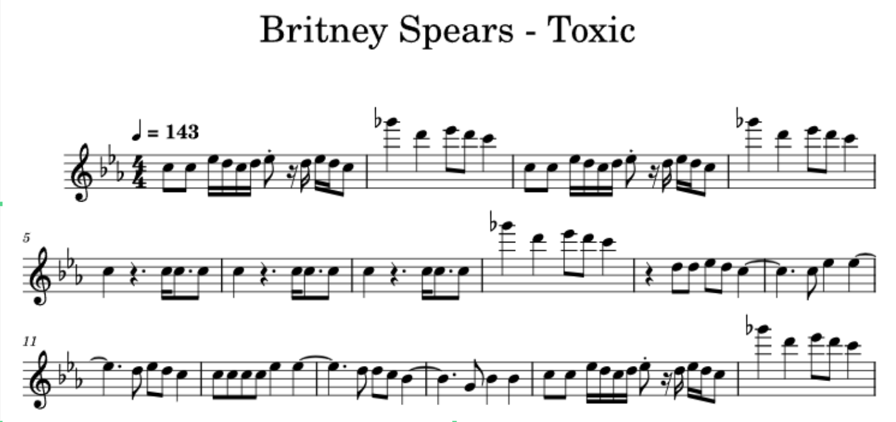
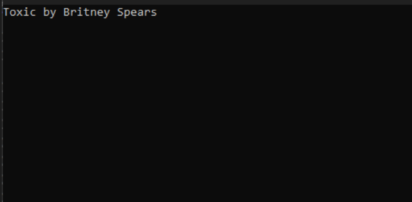

# The Britney Spears Lab: It's Britney.Bits()

This is the section where I typically give some background on the problem set, but I shouldn't need to give any introduction to The Princess of Pop, Britney Spears. Hands down, "Toxic" is one of the greatest songs of all time. Okay, so, Britney might not be your thing, and I completely understand (you're wrong). However, from a song writing point of view, it is truly a masterpiece. For the complete breakdown on how much instrumentation, creativity, and talent went into creating this song, watch this wildly detailed video here [Understanding Toxic by 12tone](https://www.youtube.com/watch?v=q0QqS8QOErA&ab_channel=12tone).

*Figure 1 - Example music program for human interpretation, more commonly called sheet music.Spears, B. (2003). Toxic [Song]. On In the Zone. Jive Records.*

So, what does Britney have to do with programming? *Everything!* Music itself is a programmable action. Essentially, musicians perform a "program" of notes which are organized and communicated in, much like programming languages, a seemingly esoteric notation which communicates meaning to those who understand the language of sheet music. Any musician with knowledge of sheet music can then recreate songs on an instrument, but also many can hear it in their head. They have been trained or "programmed" for recreating music. The analogous skill for programmers will be your ability to read computer code and mentally recreate what it is accomplishing.

## Instructions

For this lab, you will write a method that plays a small melody of at least 12 notes from a song of your choice. You will need to look up the musical notes for a melody, translate the notes to audio frequency values in Hertz, and pass those values to Console.Beep(int, int).

- Examine the example C# code on [Github](https://github.com/northeaststatecisp/CISP1010/tree/main/05-2-Toxic)

- Create a new Project in your Visual Studio Solution called TheBritneySpearsLab.

- Create a static void method in your Program class which takes no parameters, and name it something appropriate, such as PlayMarioTheme() or PlayTheFinalCountdown(). Your beep commands will live here.

- *In Main():*
  - Print the name of the song to the user
  - Invoke (call) your method

## Notes

- I understand that you may know nothing about music. Many times, programmers are asked to develop outside the domain they were trained in because our skillset is applicable in many fields. This lab is more about developing your problem-solving skills than it is about learning to code.

- Do not make this lab harder on yourself than needed. A simple melody of at least 12 notes gets the same grade as the entirety of Chopin "Nocturne in C-Sharp Minor."

- ChatGPT can be your friend and enemy here. You can ask it to list the notes for a melody and then ask it to convert those notes to frequency values. Getting the timing right so the melody sounds right is not an easy task and will require some tweaking. Also, ChatGPT can also write the C# to do the whole lab, but I have found it isn't that great at getting the timing right. It will also occasionally use a loop to run through a sequence of values, which is not a bad start to an implementation, necessarily, but it takes no account of timing and often does not get the melodies correct. So, use it to find your musical notes, be skeptical, and analyze the code an AI agent produces!

- Console.Beep(int, int) takes as its first parameter a frequency value as an int. The second parameter is the duration of time in milliseconds to play the note, also an int. You will notice that the frequencies in music are not whole numbers, but Beep takes an int value for frequency. This method is not really designed for music, so just truncate the frequency value as I did in my example.

- If you need to add pauses, call Thread.Sleep(int), which accepts an int parameter as milliseconds. This will put your program to sleep for the time duration specified.

- Have fun.

## Example Output

*Figure 2 - Display the name of the melody and play it. Pretend this screenshot is beeping at you, or make it say beep in the output, it's your program.*

## Resources

1. <https://en.wikipedia.org/wiki/Audio_frequency>

2. <https://en.wikipedia.org/wiki/Chromatic_scale>

3. <https://mixbutton.com/mixing-articles/music-note-to-frequency-chart/>
